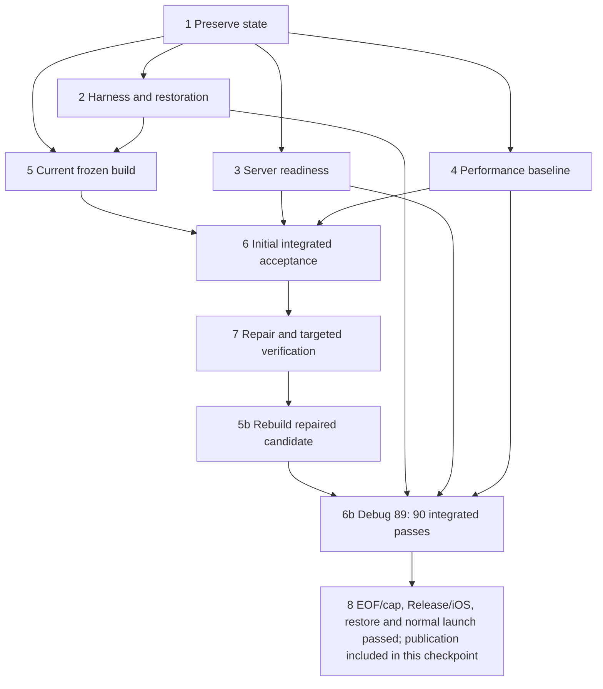
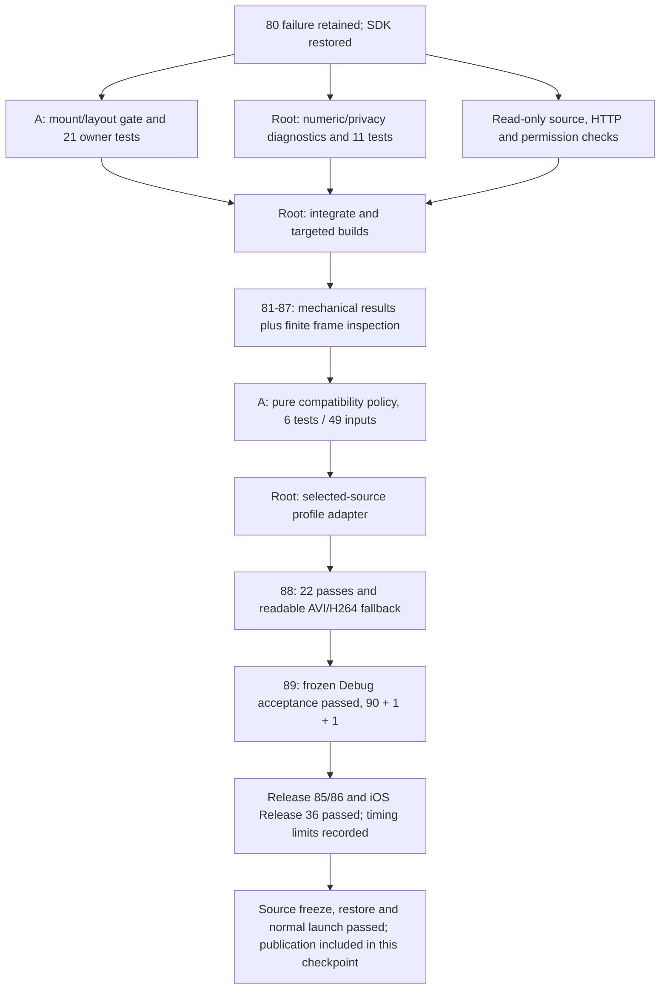

# Runtime completion plan

The human lifted the simulator/Jellyfin testing hold on 2026-10-08 and explicitly requested forked subagents with a dependency DAG. The source/API/refactor and Swift 6 objectives are complete with current runtime acceptance and retained performance measurements and limits. Implementation and evidence are included together in the client closeout commit on `feature/kids-release-candidate`; root verifies the remote revision after pushing. The current inventory is 53 extracted libraries, 74 one-way local edges, 664 retained app sources, 252 package source bodies and 15 sources in the pre-existing local targets. Physical Apple TV/live CloudKit, server boot service and App Store release remain separately deferred or owned.

| ID | Work item | Owner | Dependencies | Acceptance |
| --- | --- | --- | --- | --- |
| 1 | Preserve checkout, signing/SDK inputs, installed account and local progress | Root | None | Existing local edits/locks unchanged; complete SDK snapshot retained; no uninstall |
| 2 | Review harness, count/skip validity and SDK restoration | acceptance_plan | 1 | Current selection 90 / 1 / 1; strict result-verifier tests; recovery commands available |
| 3 | Confirm server and network readiness | server_readiness / Ongoing Maintenance | 1 | Both LAN aliases healthy, expected server identity, unauthorized Items denied, no maintenance conflict, RAID write denial |
| 4 | Extract performance baseline and runtime failure criteria | performance_acceptance | 1 | Historical Release probe 12 separated from current Debug integration timings; prior 78 failures explicitly exercised; readable frames required |
| 5 | Build/install frozen current validation app | Root | 1, 2 | Correct app and test artifacts, signature/hash verification, account container retained |
| 6 | Run navigation, owner integration and real restricted playback/recovery | Root | 3, 4, 5 | Exactly 90 executed methods; no failures/skips; readable frames and advancing clocks; exact account/libraries |
| 7 | Repair observed defects and verify affected behavior | Root plus responsible subagent | 6 | Concrete regression evidence, targeted tests and finite visual inspection; rebuild after source changes; retain failed results |
| 8 | Verify genuine EOF/next and session cap; restore and publish | Root | 6, 7 | Separate 1 / 1 methods pass; current Release two-selector/seven-start comparison and iOS Release compile pass; final source freeze, SDK restoration/export equality, normal no-autoplay launch and source/evidence publication |

Only root builds, actuates the shared simulator, installs/runs the app, integrates code or commits. Parallel agents have disjoint source, review, utility or documentation ownership; they do not run competing builds or generate concurrent streams. Server observations are read-only. Every RAID media file remains immutable; no scans, catalog/account changes, service restarts or media writes are part of this plan.

Preserved baseline: `/private/tmp/kids-resumed-baseline.json`. Simulator: C185BD69-BF46-4520-AC7E-8174AEA534E3, Apple TV 4K third generation, tvOS 27. Initial source checkpoint: `d431ccf1`. The first resumed live attempt was session 80. Failed/cancelled attempts remain failures and are never relabeled as passes. The SDK helper backs up/restores the exact account/library state; no credentials are placed in commands, test environments or reports. If interrupted, root stops the runner/player before explicit SDK restoration and export/equality verification.

Final evidence belongs in the current goal disposition and completion audit after actual execution. Review counts, old playback results, fixture tests and compilation cannot substitute for these runtime checks.

## Session 80 and initial repair branch

The first resumed run executed 81 acceptance methods: 80 passed and one AVI startup check failed. Separate genuine EOF/next and session-cap methods both passed; there were zero skips. The original full SDK state was restored/exported equal, and compiled/installed executable hashes matched. Episode seek/relaunch, movie transport and exact-item Retry passed. Bounded independent server observation corroborated DirectPlay, advancing position and cleanup; position changes alone do not prove decoded frames. Failed/incomplete evidence remains retained in `build/validation/resumed-80-results.json` and `performance-resumed-80`.

The approved AVI source prefix decoded 119 frames and audio over five seconds with server FFmpeg, output to null, under verified RAID write denial. The client trace stalled at one decoded picture, zero displayed pictures and no advancing clock after fast authorization/provider/open. This motivated a generation-scoped mount/layout-before-open gate and numeric startup diagnostics.

## Mounting, visual inspection and compatibility repair

Mechanical player counters and advancing time were insufficient: retained frames from several targeted attempts showed green noise or otherwise unreadable output. Root performs finite inspection of retained frames for each repair attempt, alongside the actual clock and pause/resume checks. The readable-frame requirement and 30-second AVI startup bound remain unchanged.

| Attempt | Mechanical result | Visual/result disposition | Preservation |
| --- | --- | --- | --- |
| 81 | Targeted approved AVI frame/clock/pause/resume checks passed | One UIKit window fixture failed; AVI output showed green noise. Not an accepted complete result. | Full SDK state restored equal |
| 83 | Repaired UIKit fixture and all 22 selected checks passed | AVI output remained visually bad. Mechanical pass did not establish acceptable playback. | Full SDK state restored equal |
| 85 | Forced-avcodec trial: all 22 selected checks passed | Visual failure; trial option removed | Full SDK state restored equal |
| 86 | No-direct-render trial: all 22 selected checks passed | Visual failure; trial option removed | Full SDK state restored equal |
| 87 | Legacy-display trial: all 22 selected checks passed | Visual failure; trial option removed | Full SDK state restored equal |
| 88 | Current Debug app: all 22 selected checks passed | Clean, readable approved AVI frames, advancing clock and pause/resume with H264 fallback | Full SDK state restored/exported equal |

Independent source checks decoded clean five- and fourteen-second prefixes with server FFmpeg. The HTTP 4,096-byte prefix matched the approved source. Existing restricted-account transcoding permission and internal source paths were verified under RAID write denial. These bounded checks support the repair investigation; they do not establish whole-file health or library-wide codec support.

Agent A's mount gate has 21 owner tests; root's numeric/privacy checks have 11 tests; the strict harness verifier has 13 tests. Agent A's pure MPEG-4/AVI compatibility policy has six tests covering 49 inputs. The tvOS adapter composes the selected source with the existing mostCompatible profile only when that policy matches; other sources retain the current preferences. Target 88 verifies the exact approved AVI through H264 fallback. None of the unsuccessful decoder/render trial flags remain in the current source.

## Current execution checkpoint

Full acceptance 89 passed against frozen Debug 88: exactly 90 integrated methods, one genuine EOF/next method and one session-cap method, with zero failures, skips or expected failures. The compiled/installed executable SHA-256 is `74c5bb520b1cef7bcfcd83b3779c950db8c0009c77e69e93229c9b033ab23ffe`. The complete original/restored SDK exports compare equal and match the original pre-install session 80 baseline; the recorded source inputs remained unchanged. See [the recorded results](../../build/validation/resumed-89-results.json) and [the resumed acceptance report](resumed-client-acceptance.md).

The retained [AVI 89 frame](../../build/validation/avi-89-attachments/E6E5570F-14E0-41A3-828F-B0F65205F73E.png) is clean and readable. This visual inspection supplements the passing frame/clock/pause/resume checks; the mechanical results alone did not establish readable playback in the earlier trials.

The first Release 84 build failed because its @testable imports lacked enable-testing. The final tvOS Release build succeeded with `-O`, no `DEBUG` and `ENABLE_TESTABILITY=YES`; its profile harness excludes `KidsApplicationBoundaryTests.swift`, whose Debug-only fixtures already passed in acceptance 89. Profile 84 was aborted after detecting the old installed Debug executable, and its full SDK state was restored to baseline 80. These unsuccessful attempts remain recorded.

Release profiles 85 and quiet 86 each passed exactly two methods and seven validated H264 direct-play starts: two ordered, one Shuffle and four movie. Both had zero failures, skips and malformed trace lines. The candidate Release SHA-256 is `86651095246a5ab2b0966cd67c83f15c7c8c80722b4a814fa61f39a261159317`; all four installed-hash checks in each run matched. The original/restored exports for both runs equal original 80. iOS Release 36 passed with zero errors and zero owned Swift/generated-macro diagnostics; inherited SVGKit-header and lint diagnostics remain separate. All 1,212 accepted compiler-input hashes remained unchanged after that compile.

The [Release comparison](../performance/2026-10-08-package-release-comparison.md) records a partial persistent slowdown. Quiet 86's ordered first output was 1.403 seconds, 27.2% above the historical 1.103-second baseline; Shuffle was 1.258 seconds, 54.2% above baseline; movie was 1.438 seconds, 0.4% below baseline. Bandwidth-operation and transfer durations increased while time to first byte was similar. The current Mac used Wi-Fi/en1 with inactive Ethernet; the historical route is unknown, and current ancillary catalog work is larger. These small measured samples establish neither a causal regression nor statistical performance nonregression. No mechanical disk-seek floor is proven.

Root launched Release 86 normally without arguments and observed [Shows, Movies, Parents and approved child cards](../../build/validation/resumed-normal-release-86.png), with no autoplay. All test streams are stopped, no further tests are planned and full original state is preserved. The source/API/refactor and Swift 6 objectives are complete with actual runtime acceptance and retained measurements/limits. Implementation and evidence are included together in the client closeout commit on `feature/kids-release-candidate`; root verifies the remote revision after pushing. Physical-device/live CloudKit, server boot/reboot and App Store release acceptance remain explicitly deferred or separately owned.
